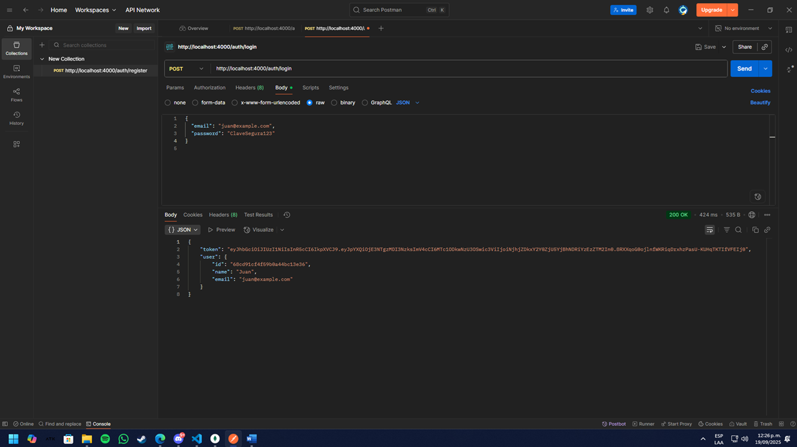
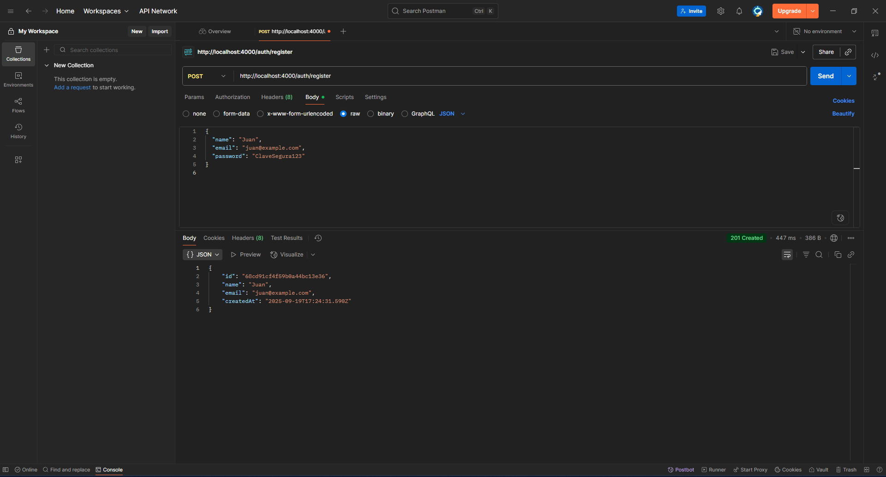
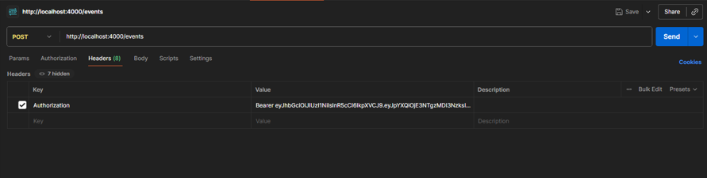
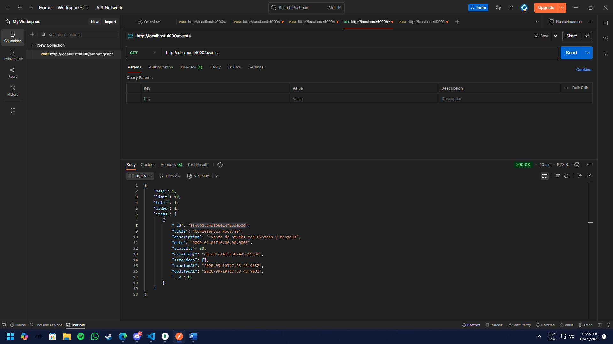

Este proyecto implementa un backend con Node.js, Express y MongoDB, incluyendo autenticación con JWT y gestión de eventos.
Hace parte de mi prueba técnica.
Requisitos

Node.js
 v18 o superior

MongoDB
 (local con Compass o en Atlas, yo utilize compass en Local)

Postman
 (para ejecutar las pruebas incluidas)

Instalación

1. Clonar el repositorio:

2. Instalar dependencias:

3 Crear el archivo .env en la raíz del proyecto, basado en .env.example:
PORT=4000
MONGO_URL=mongodb://localhost:27017/prueba_backend
JWT_SECRET=supersecreto_muy_largo_y_unico
JWT_EXPIRES=7d
4. Iniciar el servidor en modo desarrollo:
npm run dev

Servidor disponible en:
http://localhost:4000 

Endpoints disponibles
Usuarios

POST /auth/register → Registro de usuario.

POST /auth/login → Login con email y password, devuelve JWT.

Eventos

POST /events → Crear evento (requiere token).

GET /events → Listar eventos (con paginación y filtros).

POST /events/:id/register → Inscribirse en un evento (requiere token).

Pruebas con Postman
En el proyecto se incluye la colección:
Prueba_backend.postman_collection.json

1. Importar colección

En Postman: Collections > Import > File.

Selecciona Prueba_backend.postman_collection.json.

2. Variables de entorno

La colección usa variables configurables:

{{baseUrl}} → por defecto http://localhost:4000.

{{token}} → se llena tras el login.

{{eventId}} → se llena tras crear un evento.

3. Flujo de pruebas

Auth - Register → Crea un usuario.

Auth - Login → Devuelve un token. Copiarlo en {{token}}.

Events - Create Event → Crear evento (requiere {{token}}).

Events - List Events → Ver eventos creados.

Events - Register to Event → Inscribirse (requiere {{token}} y {{eventId}}).

Ejemplo de header en requests protegidos:

Authorization: Bearer {{token}}

